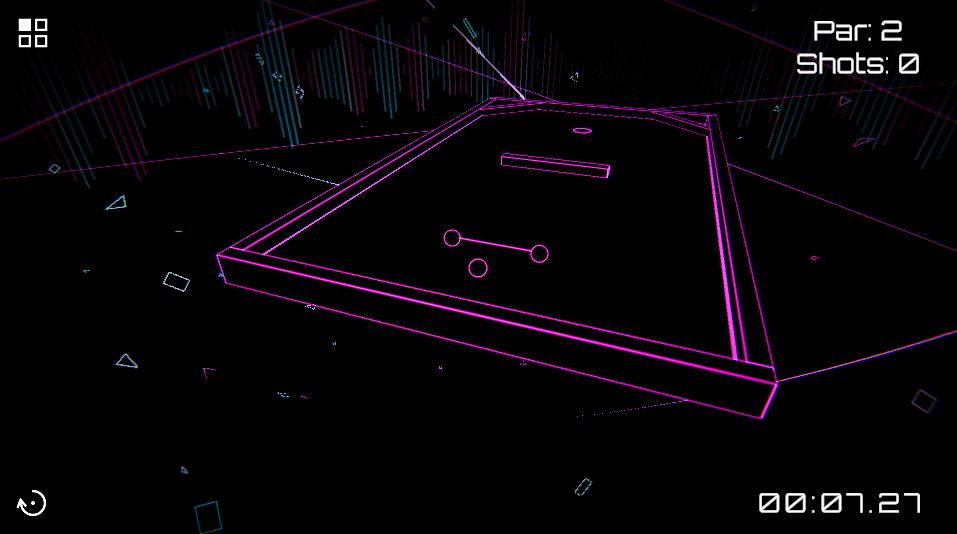

# CRACK-SHOT

2つの球を結ぶライン「GATE」を通しながら、ホールを目指すミニゴルフパズル

 

  

 

## Rules

- **CLEAR** — GATEを通過してホールイン
- **SUCCESS** — GATEを通過
- **MISS** — GATEを未通過 ／ 球に接触

## Controls

**Ball**

- **SHOT** — 左ドラッグ（球の近くで離すとキャンセル）
- **CHANGE** — ←→ ／ A D

**Camera**

- **ROTATE** — 右ドラッグ
- **ZOOM** — ホイール

## Features

- **STAGES** — 全4ステージ
- **RECORD** — ベスト打数＆タイムを記録
- **CONFIG** — 音量・カメラ感度の設定に対応

## Built with

- **Unity** 2022.3.61f1
- **URP** 14.0.12
- **TextMesh Pro**

## Credit

- **BGM** — [踊る、宇宙の中で](https://dova-s.jp/bgm/detail/15926) ／ DOVA-SYNDROME
- **Font** — [Orbitron](https://fonts.google.com/specimen/Orbitron) ／ Google Fonts（SIL OFL）

## License

[**MIT License**](LICENSE) © 2026 Mimish

ソースコードは MIT ライセンスのもとで公開している。
BGM・効果音などの音素材はすべて、ライセンスの都合によりリポジトリには含まれていない。
同梱フォント Orbitron は SIL Open Font License に従う。
